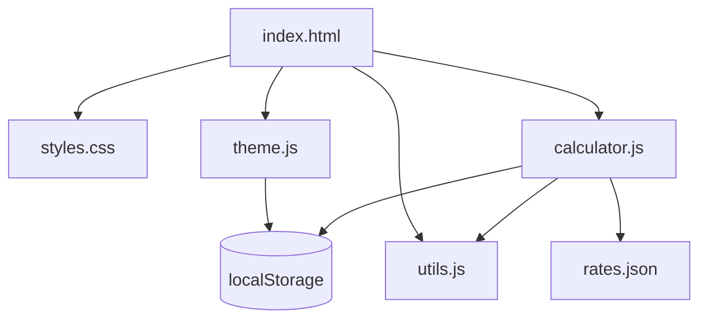

# Shouhizei — GST/VAT Calculator

Shouhizei (消費税) is a simple, interactive, and responsive GST/VAT calculator built with vanilla HTML, CSS, and JavaScript. It provides real-time calculations based on international tax rates and adapts its terminology and currency symbols dynamically.

## Purpose

The primary goal of Shouhizei is to offer a lightweight, accessible, and framework-free tool for calculating consumption taxes across different countries. It is designed to be fast, privacy-focused (no external dependencies), and easy to deploy as a static site.

## Key Features

- **Country-specific Rates:** Automatically pre-populates GST/VAT rates for over 100 countries from a local `rates.json`.
- **Currency Symbol Support:** Displays the correct currency symbol (e.g., £, €, ¥, $) and formats values according to the selected country.
- **Dynamic Tax Labels:** UI labels update to reflect local tax terminology (e.g., GST, VAT, Consumption Tax, IVA, etc.).
- **Bi-directional Calculation:** Real-time updates between "Price Excluding Tax" and "Price Including Tax".
- **Dark/Light Mode:** Includes a theme toggle with automatic system preference detection and persistence.
- **Copy-to-Clipboard:** Quickly copy results (tax amount, price with/without tax) with visual toast notifications.
- **Persistence:** Remembers your last selected country and theme preference via `localStorage`.
- **Accessibility-first:** Built with semantic HTML5, proper ARIA labels, and full keyboard navigation support.
- **Responsive & Print Friendly:** Mobile-first approach using CSS Grid/Flexbox and optimized styles for printing.

## Technology Stack

- **HTML5:** Semantic markup for structure and accessibility.
- **CSS3:** Modern layout (Grid, Flexbox) and Custom Properties for theming.
- **Vanilla JavaScript (ES6+):** Pure DOM manipulation without external frameworks.
- **Deno:** Used for the local development server and task management.

## Project Structure

```text
shouhizei/
├── web/                   # Website source files
│   ├── index.html         # Main entry point
│   ├── css/
│   │   ├── variables.css  # CSS Custom Properties
│   │   └── styles.css     # Main styling
│   ├── js/
│   │   ├── rates.json     # Tax rates and country data
│   │   ├── theme.js       # Dark/Light mode logic
│   │   ├── utils.js       # Helper functions (formatting, clipboard)
│   │   └── calculator.js  # Core calculation and DOM logic
│   └── assets/
│       └── shouhizei.png  # Logo and Favicon
├── AGENTS.md              # Project guidelines for AI agents
├── LICENSE                # MIT Licence
├── Makefile               # Task runner (serve, lint, format)
├── README.md              # Project documentation
└── serve.ts               # Deno development server
```

## Architecture



## Local Development

To run the project locally, you can use the provided Deno server script.

### Prerequisites

- [Deno](https://deno.land/) installed on your machine.

### Running the Server

Using the `Makefile`:
```bash
make serve
```

Alternatively, run the Deno command directly:
```bash
deno run --allow-net --allow-read serve.ts
```

The site will be available at `http://localhost:8000`.

## Licence

MIT Licence. See `LICENSE` for details.
